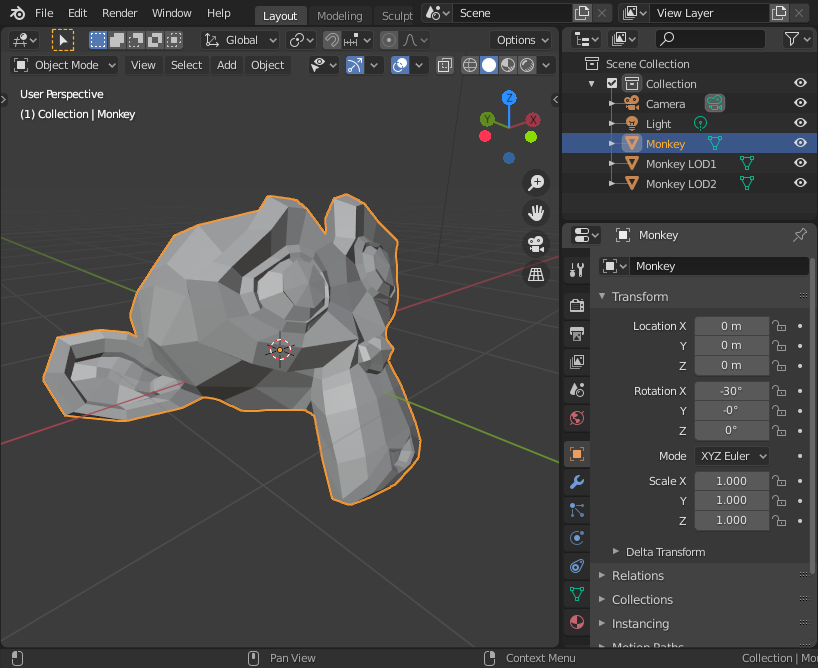
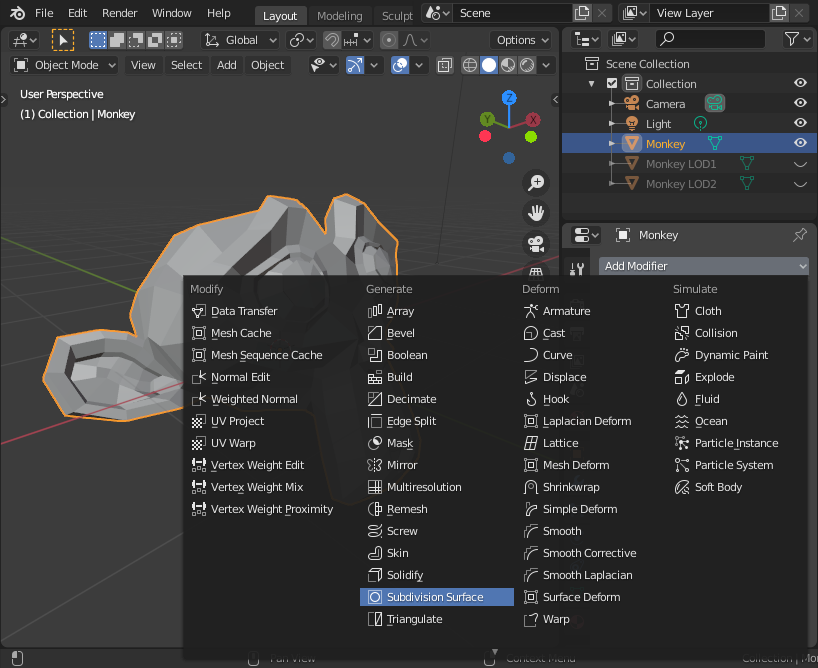
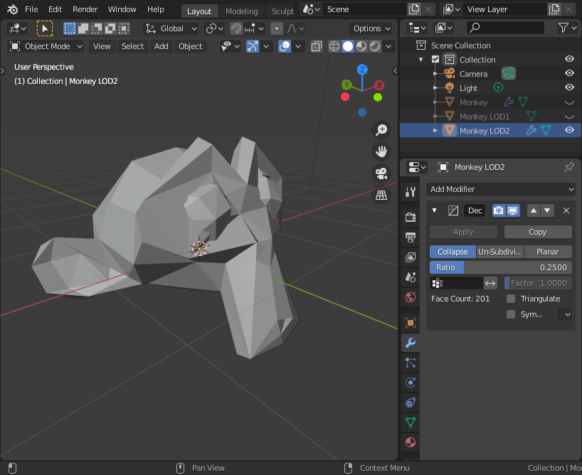
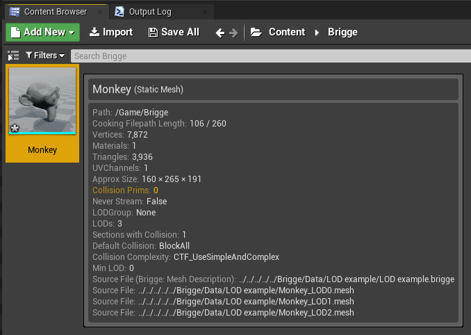
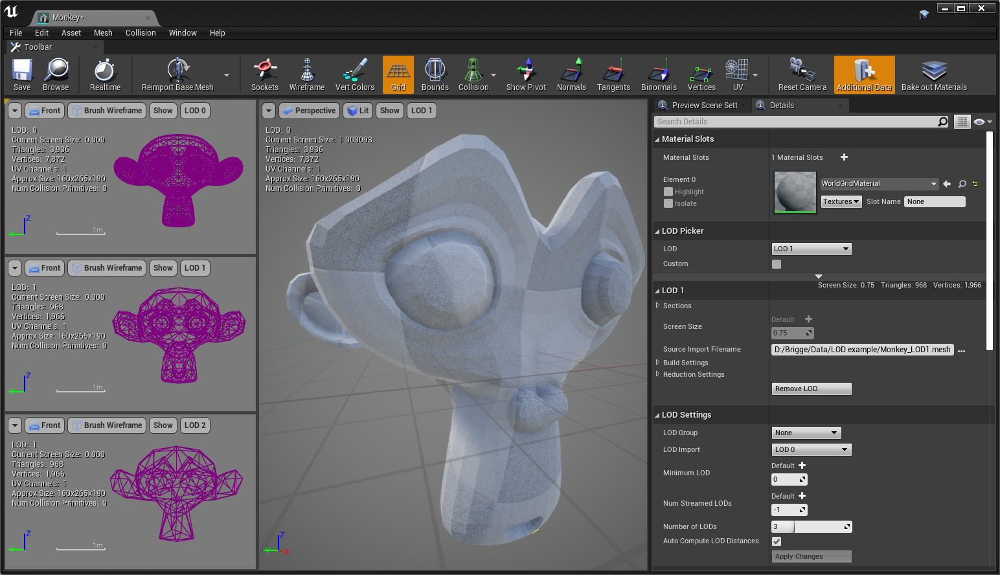

# Working with Mesh LODs

When rendering a scene we can use high detail for objects near the viewer, lower detail for objects in the background, and simple low-poly models for distant objects. These variants of a single object are called LODs, short for Levels of Detail.


## Pipeline Schemes

Like most 3D packages, Blender itself does not have a concept of LODs. Game art pipelines must invent a scheme to collect multiple LODs as part of a single game asset. For example Unreal's FBX pipeline uses a combination of a naming scheme, parenting, and empties. Once you set *everything* up correctly in Blender and export to FBX, Unreal will show your LODs in the game.

With Brigge we always strive to keep it simple, and not impose one "correct" way of working. Brigge uses a naming scheme for LODs and you can organize the Blender project however you want!

The LODs for an asset named `Prop` should be named:

|LOD#|Name|
|:---:|---|
|0|`Prop_LOD0` _or simply_ `Prop`|
|1|`Prop_LOD1`|
|...|...|
|7|`Prop_LOD7`|

Brigge also accepts spaces or dots between the asset name and `LOD#`, so `Prop LOD1` and `Prop.LOD3` work too.

LOD 0 is the most detailed version.

## Blender

#### Create Objects

Each LOD of your asset is its own mesh object in Blender. For a quick example, let's make a monkey head with high, medium, and low resolution LODs.

1. Add a Monkey mesh to your scene. `shift A`, Mesh, Monkey
2. Rotate the monkey so its face is looking up. `R, X, 30, -`
3. Duplicate this mesh 2x at the same location. `alt D, escape, alt D, escape`
4. Rename the objects `Monkey`, `Monkey LOD1`, `Monkey LOD2`



5. Add a Subdivision Surface modifier to `Monkey` to increase its poly count



6. Add a Decimate modifier to `Monkey LOD2` to reduce its poly count, using Ratio 0.25



#### Manage LODs In Your Project

Since Brigge relies on a naming scheme only, you can arrange the Blender project however you want. But having multiple objects belonging to each asset can lead to a mess! Here are some ways people manage the complexity.


* Collections

  > Put all of an asset's LODs into a collection. This doesn't help with spatial organization -- where things are in 3D -- but it _does_ make them easy to select, hide, or show all at once. Even when collapsed in the outliner. Brigge ignores the collection name, so use whatever makes sense.

<br clear="all">


* Object Parent

  > Use one of the LOD meshes as a parent, the rest as children. LOD 0 is probably best since you can call it `Monkey` instead of `Monkey_LOD#`. When you reposition or scale the parent, the others stay in sync.

<br clear="all">


* Empty Parent

  > Add an empty as a parent, with all the LODs as children. When you reposition or scale the empty, the meshes stay in sync. Brigge does not export this empty or care what its name is. Blender won't let you name it the same as an LOD mesh since they are both objects. 

No matter how you organize the project, Brigge uses the final transform of LOD 0 (position, rotation, scale). You can keep all LOD origins in the same place or spread them out like at the top of this page.

#### Export

Select any of the Monkey LODs and use `File > Export > Brigge for Meshes` from the menu bar. You don't have to hand-select all the LODs; it will automatically gather them for each exported mesh.

These files are written:

`LOD example.brigge` which contains
```
mesh named 'Monkey' at (0, 0, 0) {
  rotation = -30 degrees about 'X'
}
```

`Monkey_LOD0.mesh`

`Monkey_LOD1.mesh`

`Monkey_LOD2.mesh`

## Unreal

#### Import

Import the `.brigge` file into Unreal Editor. This creates a StaticMesh asset and places an Actor in the level.



#### Examine

Double-click `Monkey` in the Content Browser to open the Static Mesh Editor. Here we can examine LODs and edit their properties.



For example, we can see vertex and triangle counts:
|LOD#|Triangles|Vertices|
|:---:|---:|---:|
|0|3936|7872|
|1|968|1966|
|2|240|642|

Notice the monkey here is facing straight ahead, without the 30° tilt we added in Blender. In general, rotation affects the Actor, not the StaticMesh. The monkey in the level *does* have the tilt! You can place more monkeys into the level, each with its own independent position, rotation, and scale.


### Notes

_Unreal supports up to 8 LODs (numbered 0..7) for each StaticMesh asset._

_Brigge 0.8.8 assigns the same materials to each LOD in a mesh. We will support arbitrary LOD + Material combinations in a later update._

_This example shows Blender 2.83 --> Brigge for Meshes 0.8.8 --> Unreal Engine 4.25.1_
